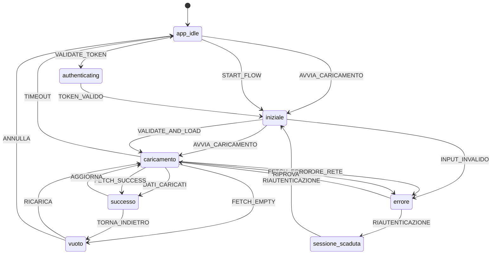

# UI Specifications — Indice

Generato il: 2026-04-23 17:31

Questo file contiene l'indice di tutte le specifiche UI generate dalla macchina a stati.

---

## 📋 Elenco Stati UI

| # | Stato | File | Tipo | Descrizione |
|---|-------|------|------|-------------|
| 1 | `app_idle` | [UI_app_idle.md](UI_app_idle.md) | 🖥️ Schermata | Schermata iniziale dell'applicazione. Punto di ingresso d... |
| 2 | `iniziale` | [UI_iniziale.md](UI_iniziale.md) | 🖥️ Schermata | Schermata di validazione iniziale. L'utente inserisce i d... |
| 3 | `caricamento` | [UI_caricamento.md](UI_caricamento.md) | ⏳ Transitorio | Stato transitorio di loading. Mostra skeleton UI mentre i... |
| 4 | `vuoto` | [UI_vuoto.md](UI_vuoto.md) | 🖥️ Schermata | Schermata quando non ci sono dati da visualizzare. L'uten... |
| 5 | `errore` | [UI_errore.md](UI_errore.md) | 🖥️ Schermata | Schermata di errore. Mostra banner e toast di errore quan... |
| 6 | `successo` | [UI_successo.md](UI_successo.md) | 🖥️ Schermata | Schermata principale con dati caricati con successo. Dash... |
| 7 | `sessione_scaduta` | [UI_sessione_scaduta.md](UI_sessione_scaduta.md) | 🖥️ Schermata | Schermata di riautenticazione. Appare quando la sessione ... |
| 8 | `authenticating` | [UI_authenticating.md](UI_authenticating.md) | ⏳ Transitorio | Stato transitorio di verifica token. Non visibile all'ute... |

---

## 🗺️ Diagramma di Flusso

---

## 🚀 Come Usare Questi File

1. **Scegli lo stato** che ti interessa dalla tabella sopra
2. **Apri il file** `.md` corrispondente
3. **Copia il contenuto** del file
4. **Incollalo** nel tuo strumento UI preferito:
   - [v0.dev](https://v0.dev) → UI React/Tailwind
   - [Claude Artifacts](https://claude.ai) → Componenti con logica
   - [Bolt.new](https://bolt.new) → App complete
   - [Lovable](https://lovable.dev) → UI moderne
   - Figma AI → Design
   - Oppure semplicemente consegnalo a uno sviluppatore
5. **Itera** sulla UI usando le interazioni descritte nel file

---

## 🔄 Flussi Principali

### Flusso di Autenticazione

`app_idle` → `iniziale` → `caricamento` → `successo` → `errore` → `sessione_scaduta`

### Flusso di Caricamento Dati

`iniziale` → `caricamento` → `successo` → `vuoto` → `errore`

