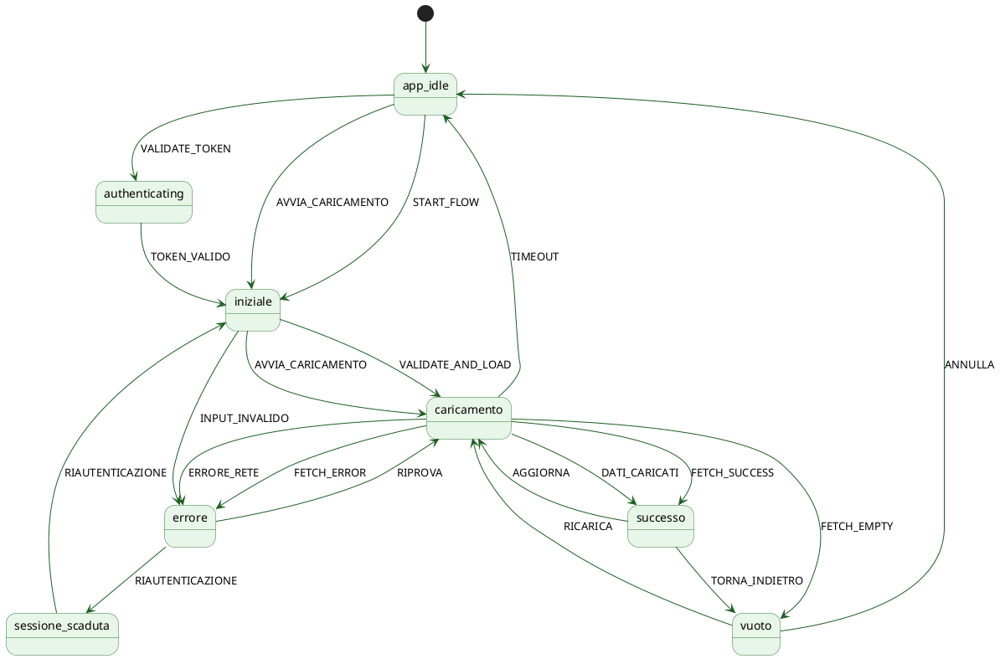

# UI Specifications — Indice

Generato il: 2026-04-23 17:43

Questo file contiene l'indice di tutte le specifiche UI generate dalla macchina a stati e dai flussi del prodotto.

---

## 📋 Livello 1: Schermate Reali (Screens)

Specifiche UI per ogni schermata del prodotto, con componenti, dati, interazioni e link agli stati della macchina correlati.

| # | Schermata | File | Descrizione |
|---|-----------|------|-------------|
| 1 | Login | [01_login.md](screens/01_login.md) | Autenticazione, form credenziali, accesso demo |
| 2 | Dashboard | [02_dashboard.md](screens/02_dashboard.md) | Hub clinico, risparmi YTD, distributori, acquisti |
| 3 | Catalogo | [03_catalogo.md](screens/03_catalogo.md) | Ricerca farmaci, benchmarking, alternative |
| 4 | Offerte | [04_offerte.md](screens/04_offerte.md) | Deal, flash sales, countdown timer |
| 5 | Alert | [05_alert.md](screens/05_alert.md) | Notifiche prezzi, opportunità, cluster, stock |
| 6 | Confronti | [06_confronti.md](screens/06_confronti.md) | Benchmarking, clustering, grafici comparativi |

---

## 📋 Livello 2: Stati della Macchina (States)

Stati astratti della macchina a stati XState. Ogni schermata reale li utilizza per gestire i diversi stati UI (loading, successo, errore, vuoto).

| # | Stato | File | Tipo | Descrizione |
|---|-------|------|------|-------------|
| 1 | `app_idle` | [UI_app_idle.md](states/UI_app_idle.md) | 🖥️ Schermata | Schermata iniziale dell'applicazione |
| 2 | `iniziale` | [UI_iniziale.md](states/UI_iniziale.md) | 🖥️ Schermata | Validazione input e configurazione |
| 3 | `caricamento` | [UI_caricamento.md](states/UI_caricamento.md) | ⏳ Transitorio | Skeleton UI durante caricamento |
| 4 | `vuoto` | [UI_vuoto.md](states/UI_vuoto.md) | 🖥️ Schermata | Nessun dato disponibile |
| 5 | `errore` | [UI_errore.md](states/UI_errore.md) | 🖥️ Schermata | Banner e toast di errore |
| 6 | `successo` | [UI_successo.md](states/UI_successo.md) | 🖥️ Schermata | Dashboard con dati caricati |
| 7 | `sessione_scaduta` | [UI_sessione_scaduta.md](states/UI_sessione_scaduta.md) | 🖥️ Schermata | Riautenticazione richiesta |
| 8 | `authenticating` | [UI_authenticating.md](states/UI_authenticating.md) | ⏳ Transitorio | Verifica token (non visibile) |

---

## 🗺️ Diagramma di Flusso (PlantUML)



---

## 🔄 Mappatura Schermate → Stati

| Schermata | Stati Correlati |
|-----------|----------------|
| **Login** | `app_idle` → `authenticating` → `iniziale` / `sessione_scaduta` → `errore` |
| **Dashboard** | `caricamento` → `successo` / `vuoto` / `errore` |
| **Catalogo** | `caricamento` → `successo` / `vuoto` / `errore` |
| **Offerte** | `caricamento` → `successo` / `vuoto` / `errore` |
| **Alert** | `caricamento` → `successo` / `vuoto` / `errore` |
| **Confronti** | `caricamento` → `successo` / `vuoto` / `errore` |

---

## 🚀 Come Usare Questi File

### Per generare UI con AI tools:

1. **Scegli una schermata** dalla tabella "Schermate Reali"
2. **Apri il file** `.md` corrispondente
3. **Copia il contenuto** del file
4. **Incollalo** nel tuo strumento UI preferito:
   - [v0.dev](https://v0.dev) → UI React/Tailwind
   - [Claude Artifacts](https://claude.ai) → Componenti con logica
   - [Bolt.new](https://bolt.new) → App complete
   - [Lovable](https://lovable.dev) → UI moderne
   - Figma AI → Design
   - Oppure consegnalo a uno sviluppatore

### Per capire gli stati UI:

1. **Apri una schermata** (es. `02_dashboard.md`)
2. **Guarda la tabella** "Stati della Macchina Correlati"
3. **Apri gli stati** nella cartella `states/` per i dettagli

### Per renderizzare il diagramma:

1. **PlantUML online**: https://www.plantuml.com/plantuml/ — incolla il codice
2. **VS Code**: estensione "PlantUML" di jebbs
3. **IntelliJ**: plugin "PlantUML integration"
4. **CLI**: `plantuml README.md` (se installato)

---

## 🔄 Flussi Principali

### Flusso di Autenticazione

```
[Login] → [Authenticating] → [Dashboard]
  │            │                  │
  │            └─→ [Errore] ──────┘
  │
  └─→ [Demo] → [Iniziale] → [Dashboard]
```

### Flusso di Caricamento Dati

```
[Dashboard] → [Loading] → [Successo]
                │             │
                ├─→ [Vuoto]   ├─→ [Aggiorna] → [Loading]
                │             │
                └─→ [Errore] ─┘
```

### Flusso Completo

```
[Login] → [Dashboard] → [Catalogo] → [Offerte] → [Alert] → [Confronti]
   │          │             │             │            │           │
   └──────────┴─────────────┴─────────────┴────────────┴───────────┘
                         (navigazione tab)