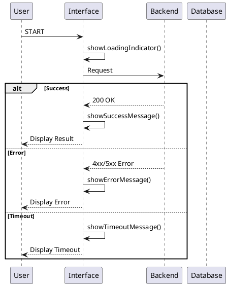

# Specifica Funzionale

Generato: 2026-04-23 13:38:39

> Specifica generata automaticamente dal contesto del progetto.

---

## 1. Panoramica

### 1.1 Scope
- Flussi utente
- Macchina a stati (XState eseguibile)
- Analisi edge case
- Gestione errori
- Contratti API

---

## 2. Flussi Utente

### authentication_flow
1. **Trigger**: User enters credentials
   **Action**: POST /api/auth/login
   **Outcome**: Zustand store updated, clinic context loaded
   **Error**: Invalid credentials or network failure triggers auth_error state
1. **Trigger**: Token validation check
   **Action**: Verify JWT expiry
   **Outcome**: Proceed to dashboard or force re-login
   **Error**: Expired token triggers auth_error and redirects to login screen

### core_dashboard_benchmark_flow
1. **Trigger**: App mounts after auth
   **Action**: GET /api/dashboard/metrics & /api/benchmark/prices
   **Outcome**: YTD savings, cluster badge, and price indicators rendered
   **Error**: Timeout or 5xx error transitions to api_timeout or api_error with retry option
1. **Trigger**: User filters catalog
   **Action**: GET /api/catalog/medicines with query params
   **Outcome**: Filtered list with network discounts and alternatives
   **Error**: Empty results trigger catalog_empty state with category suggestions

### smart_group_join_flow
1. **Trigger**: User taps 'Join Group' on smart suggestion
   **Action**: POST /api/groups/join with clinicId and quantity
   **Outcome**: Group progress updates, confirmation toast shown
   **Error**: Capacity full or invalid quantity triggers api_error with specific message
1. **Trigger**: Group target reached
   **Action**: Webhook/Real-time update from Convex
   **Outcome**: Push notification sent, order auto-placed, status changes to 'Completed'
   **Error**: Supplier stock unavailable triggers fallback alert and partial fulfillment

### error_handling_flow
1. **Trigger**: Any API request fails
   **Action**: Catch error in Zustand/Convex query
   **Outcome**: Transition to api_error, show retry dialog, log to analytics
   **Error**: Retry fails twice, show persistent error banner with support link
1. **Trigger**: Request exceeds 10s
   **Action**: AbortController triggers
   **Outcome**: Transition to api_timeout, fallback to cached data if available
   **Error**: No cache available, show empty state with refresh prompt

### empty_state_recovery_flow
1. **Trigger**: No data found for dashboard or catalog
   **Action**: Render empty state UI
   **Outcome**: Illustration, descriptive text, and CTA button displayed
   **Error**: CTA fails due to permissions, show toast explaining access level
1. **Trigger**: User completes onboarding or makes first purchase
   **Action**: Data sync triggers
   **Outcome**: Empty state transitions to ready state, benchmarking activates
   **Error**: Sync delay causes temporary mismatch, handled by optimistic UI updates


---

## 3. Macchina a Stati

### 3.1 Diagramma Stati (PlantUML)

```plantuml
@startuml

state "appFlow" {

    [*] --> idle

    state "app_idle" {
        note: Entry: init_store, check_session
        app_idle --> auth_loading : TRIGGER_LOGIN

    state "auth_loading" {
        note: Entry: show_loader, disable_ui
        auth_loading --> auth_success : AUTH_SUCCESS
        auth_loading --> auth_error : AUTH_FAIL

    state "auth_success" {
        note: Entry: set_zustand_auth, fetch_clinic_context
        auth_success --> dashboard_loading : NAVIGATE_DASHBOARD
        auth_success --> catalog_loading : NAVIGATE_CATALOG

    state "auth_error" {
        note: Entry: show_error_toast, log_auth_failure

    state "dashboard_loading" {
        note: Entry: show_skeleton, start_pull_refresh
        dashboard_loading --> dashboard_empty : DATA_FETCHED
        dashboard_loading --> api_error : FETCH_ERROR
        dashboard_loading --> api_timeout : REQUEST_TIMEOUT
        dashboard_loading --> api_cancel : REQUEST_CANCELLED

    state "dashboard_ready" {
        note: Entry: render_charts, update_indicators
        dashboard_ready --> benchmark_loading : LOAD_BENCHMARK
        dashboard_ready --> group_loading : LOAD_GROUPS

    state "dashboard_empty" {
        note: Entry: show_empty_illustration, prompt_onboarding

    state "catalog_loading" {
        note: Entry: debounce_search, show_skeleton
        catalog_loading --> catalog_empty : SEARCH_COMPLETE
        catalog_loading --> api_error : FETCH_ERROR
        catalog_loading --> api_timeout : REQUEST_TIMEOUT
        catalog_loading --> api_cancel : REQUEST_CANCELLED

    state "catalog_ready" {
        note: Entry: render_price_comparison, highlight_savings

    state "catalog_empty" {
        note: Entry: show_no_results, suggest_categories

    state "benchmark_loading" {
        note: Entry: fetch_cluster_data, compute_savings
        benchmark_loading --> benchmark_ready : BENCHMARK_FETCHED
        benchmark_loading --> api_error : FETCH_ERROR
        benchmark_loading --> api_timeout : REQUEST_TIMEOUT
        benchmark_loading --> api_cancel : REQUEST_CANCELLED

    state "benchmark_ready" {
        note: Entry: render_comparison_chart, update_positioning

    state "group_loading" {
        note: Entry: fetch_group_targets, calculate_participation
        group_loading --> group_ready : GROUPS_FETCHED
        group_loading --> api_error : FETCH_ERROR
        group_loading --> api_timeout : REQUEST_TIMEOUT
        group_loading --> api_cancel : REQUEST_CANCELLED

    state "group_ready" {
        note: Entry: render_progress_bars, enable_join_action

    state "api_error" {
        note: Entry: show_retry_dialog, log_error
        api_error --> dashboard_loading : RETRY_REQUEST

    state "api_timeout" {
        note: Entry: show_timeout_message, fallback_to_cache
        api_timeout --> dashboard_loading : RETRY_REQUEST

    state "api_cancel" {
        note: Entry: clear_loading_state, restore_previous_view
        api_cancel --> app_idle : RETURN_HOME

    [*] <-- cancelled
    [*] <-- success

}
@enduml
```

### 3.2 Configurazione XState

```json
{
  "id": "appFlow",
  "initial": "idle",
  "context": {
    "user": null,
    "errors": [],
    "retryCount": 0
  },
  "states": {
    "app_idle": {
      "entry": [
        "init_store",
        "check_session"
      ],
      "exit": [
        "clear_pending_requests"
      ],
      "on": {
        "TRIGGER_LOGIN": "auth_loading"
      }
    },
    "auth_loading": {
      "entry": [
        "show_loader",
        "disable_ui"
      ],
      "exit": [
        "hide_loader",
        "enable_ui"
      ],
      "on": {
        "AUTH_SUCCESS": "auth_success",
        "AUTH_FAIL": "auth_error"
      }
    },
    "auth_success": {
      "entry": [
        "set_zustand_auth",
        "fetch_clinic_context"
      ],
      "exit": [
        "invalidate_token_if_expired"
      ],
      "on": {
        "NAVIGATE_DASHBOARD": "dashboard_loading",
        "NAVIGATE_CATALOG": "catalog_loading"
      }
    },
    "auth_error": {
      "entry": [
        "show_error_toast",
        "log_auth_failure"
      ],
      "exit": [
        "reset_form"
      ],
      "on": {}
    },
    "dashboard_loading": {
      "entry": [
        "show_skeleton",
        "start_pull_refresh"
      ],
      "exit": [
        "stop_skeleton"
      ],
      "on": {
        "DATA_FETCHED": "dashboard_empty",
        "FETCH_ERROR": "api_error",
        "REQUEST_TIMEOUT": "api_timeout",
        "REQUEST_CANCELLED": "api_cancel"
      }
    },
    "dashboard_ready": {
      "entry": [
        "render_charts",
        "update_indicators"
      ],
      "exit": [
        "cache_data"
      ],
      "on": {
        "LOAD_BENCHMARK": "benchmark_loading",
        "LOAD_GROUPS": "group_loading"
      }
    },
    "dashboard_empty": {
      "entry": [
        "show_empty_illustration",
        "prompt_onboarding"
      ],
      "exit": [],
      "on": {}
    },
    "catalog_loading": {
      "entry": [
        "debounce_search",
        "show_skeleton"
      ],
      "exit": [
        "clear_search_cache"
      ],
      "on": {
        "SEARCH_COMPLETE": "catalog_empty",
        "FETCH_ERROR": "api_error",
        "REQUEST_TIMEOUT": "api_timeout",
        "REQUEST_CANCELLED": "api_cancel"
      }
    },
    "catalog_ready": {
      "entry": [
        "render_price_comparison",
        "highlight_savings"
      ],
      "exit": [],
      "on": {}
    },
    "catalog_empty": {
      "entry": [
        "show_no_results",
        "suggest_categories"
      ],
      "exit": [],
      "on": {}
    },
    "benchmark_loading": {
      "entry": [
        "fetch_cluster_data",
        "compute_savings"
      ],
      "exit": [],
      "on": {
        "BENCHMARK_FETCHED": "benchmark_ready",
        "FETCH_ERROR": "api_error",
        "REQUEST_TIMEOUT": "api_timeout",
        "REQUEST_CANCELLED": "api_cancel"
      }
    },
    "benchmark_ready": {
      "entry": [
        "render_comparison_chart",
        "update_positioning"
      ],
      "exit": [],
      "on": {}
    },
    "group_loading": {
      "entry": [
        "fetch_group_targets",
        "calculate_participation"
      ],
      "exit": [],
      "on": {
        "GROUPS_FETCHED": "group_ready",
        "FETCH_ERROR": "api_error",
        "REQUEST_TIMEOUT": "api_timeout",
        "REQUEST_CANCELLED": "api_cancel"
      }
    },
    "group_ready": {
      "entry": [
        "render_progress_bars",
        "enable_join_action"
      ],
      "exit": [],
      "on": {}
    },
    "api_error": {
      "entry": [
        "show_retry_dialog",
        "log_error"
      ],
      "exit": [
        "reset_state"
      ],
      "on": {
        "RETRY_REQUEST": "dashboard_loading"
      }
    },
    "api_timeout": {
      "entry": [
        "show_timeout_message",
        "fallback_to_cache"
      ],
      "exit": [
        "abort_request"
      ],
      "on": {
        "RETRY_REQUEST": "dashboard_loading"
      }
    },
    "api_cancel": {
      "entry": [
        "clear_loading_state",
        "restore_previous_view"
      ],
      "exit": [],
      "on": {
        "RETURN_HOME": "app_idle"
      }
    }
  }
}
```

---

## 4. Diagramma Sequenza (PlantUML)



---

## 5. Edge Cases

| ID | Scenario | Expected | Priority |
|----|----------|----------|----------|
| EC001 | Network price data missing for specific medicine | Show 'Benchmark unavailable' placeholder, hide comparison indicators, allow standard purchase flow | high |
| EC002 | Purchase group deadline expires before target quantity reached | Auto-close group, notify participants, refund pending commitments, suggest alternative groups | high |
| EC003 | Auth token expires during active benchmark calculation | Pause flow, redirect to login, preserve unsaved state, resume after re-auth | high |
| EC004 | Insufficient clinic data for clustering algorithm | Fallback to global network average, display 'Insufficient data for cluster' badge, prompt to complete onboarding | medium |
| EC005 | Pull-to-refresh triggered while device is offline | Show offline toast, prevent skeleton loop, serve cached data with 'Last updated' timestamp | medium |
| EC006 | Concurrent group join requests from multiple clinics | Server locks capacity, returns conflict error to excess requests, queue or reject gracefully | high |


---

## 6. Gestione Errori

### 6.1 Tipi di Errore

| Codice | Tipo | Messaggio Utente | Azione |
|--------|------|------------------|--------|
| 400 | Bad Request | "Dati non validi." | Correggi input |
| 401 | Unauthorized | "Sessione scaduta." | Login |
| 403 | Forbidden | "Accesso negato." | Contatta support |
| 404 | Not Found | "Risorsa non trovata." | Torna alla home |
| 408 | Timeout | "Richiesta scaduta." | Riprova |
| 429 | Rate Limited | "Troppe richieste." | Attendi |
| 500 | Server Error | "Errore temporaneo." | Riprova |
| 503 | Unavailable | "Servizio non disponibile." | Riprova dopo |

### 6.2 Stati di Errore

La macchina a stati gestisce gli errori attraverso stati dedicati che:
- Registrano l'errore per il debug
- Mostrano messaggi appropriati in italiano
- Offrono opzioni di recupero (retry, cancel, contact support)

---

## 7. Validazione Dati

### 7.1 Regole di Validazione

| Campo | Tipo | Obbligatorio | Pattern | Max Length |
|-------|------|--------------|---------|------------|
| email | email | Sì | RFC 5322 | 254 |
| password | password | Sì | Min 8 chars | 128 |
| search_query | string | Sì | Alfanumerico + spazi | 100 |
| quantity | integer | Sì | > 0 | 9999 |

### 7.2 Feedback Validazione

- Validazione inline al blur
- Validazione summary all'invio
- Messaggi chiari in italiano con istruzioni

---

## 8. Contratto API

#### POST /api/auth/login
- **Description**: Authenticate clinic owner or veterinarian, returns JWT and clinic context

#### GET /api/dashboard/metrics
- **Description**: Fetch YTD savings, top distributors, and recent purchases for authenticated clinic

#### GET /api/catalog/medicines
- **Description**: Search and filter medicines with network discounts and alternative suggestions

#### GET /api/benchmark/prices
- **Description**: Retrieve network average, min, max prices and cluster positioning for specific medicines

#### GET /api/clusters/compare
- **Description**: Fetch clustering data and efficiency ranking for peer comparison

#### POST /api/groups/join
- **Description**: Enroll clinic in a smart purchase group with specified quantity commitment

#### GET /api/groups/status
- **Description**: Track real-time progress, target quantity, and deadline for active groups

#### GET /api/alerts/network
- **Description**: Fetch personalized price alerts, stock warnings, and trend notifications

#### GET /api/purchases/history
- **Description**: Retrieve historical purchase data for benchmarking calculation

#### POST /api/sync/cache
- **Description**: Force pull-to-refresh and update local Zustand cache with latest Convex data


---

## 9. Metriche

### 9.1 Copertura Analisi

- Stati definiti: 17
- Transizioni definite: 26
- Edge case identificati: 6
- Tipi errore gestiti: 8

---

## Appendice A: Contesto Originale

Il contesto originale del progetto è in `project_context.md`.
